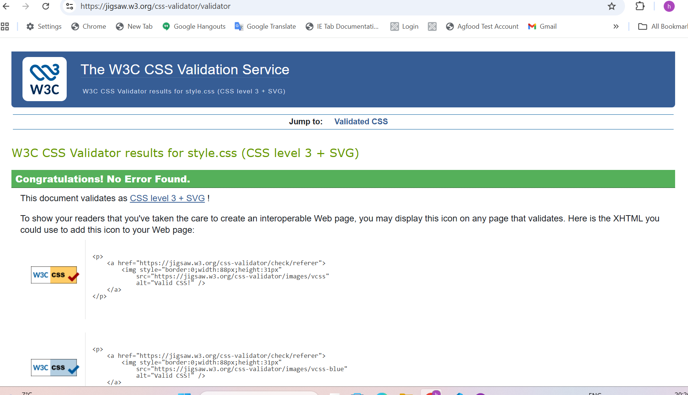
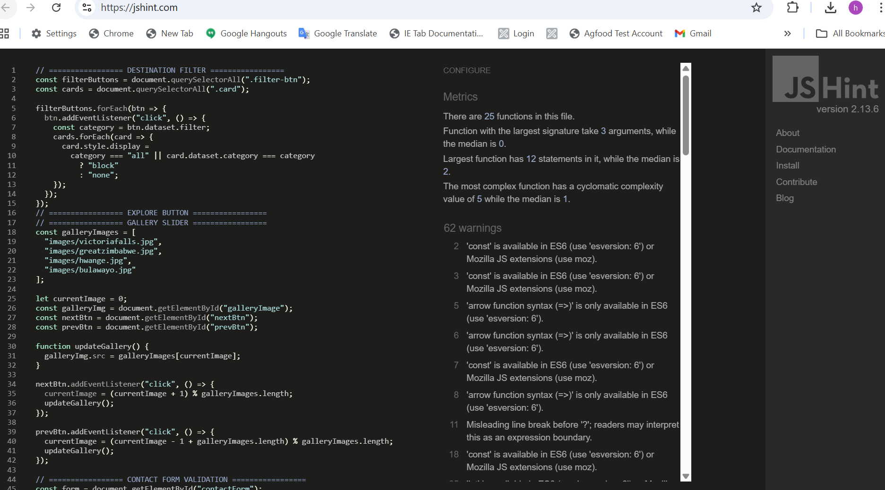

# Tour Zimbabwe

An interactive single-page web project showcasing the natural and cultural beauty of Zimbabwe.
Built using **HTML**, **CSS**, and **JavaScript**.

## Author
**Hlengiwe Ncube** 

## Start Date
**16 November 2025**

## Purpose
This project fulfills the JavaScript Assignment requirements. Demonstrating -planning, interactivity, and responsive web design.
-DOM manipulation and  responsive single-page application.
-Host the finished project on GitHub Pages for accessibility and evaluation.

## Project Links 
| Resource                        | Link                                                                                              |
| ------------------------------- | ------------------------------------------------------------------------------------------------- |
| **GitHub Repository**           | [https://github.com/HlengiweNcube/tour_zimbabwe] (https://github.com/HlengiweNcube/tour_zimbabwe) |
| **Live Website (GitHub Pages)** | [https://HlengiweNcube.github.io/tour_zimbabwe/](https://HlengiweNcube.github.io/tour_zimbabwe/)  |


## Project Concept 

**Tour Zimbabwe** is designed to promote tourism and showcase the nation’s diversity through visually engaging and interactive content.
                It demonstrates skills in front-end development, accessibility, and creative design.

## Key Features 

-**Hero Section:**          “Explore Now” button with smooth scroll to destinations.
-**Destinations Section:**   Filterable grid of top attractions (Nature, Historical, City).
-**Gallery:**                Interactive image slider with next/previous controls.
-**Contact Form:**           JavaScript validated form with real-time feedback.
-**Back to Top Button:**     Smooth scroll functionality for better UX.
-**Responsive Design:**      Works across desktop, tablet, and mobile screens.


## Design & Accessibility Highlights

- Semantic HTML structure (`<header>`, `<main>`, `<section>`, `<footer>`)  
- Skip link for screen reader accessibility  
- Proper `<label>` associations for all form inputs  
- Color contrast tested for readability  
- Clean typography using **"Times New Roman", serif** for a classic aesthetic  

## Technical Implementation

**HTML5:** Semantic and accessible markup  
**CSS3:** Flexbox, Grid, responsive media queries, hover transitions  
**JavaScript:**  
- DOM manipulation for dynamic content updates  
- Event listeners for interactivity (buttons, gallery, filters)  
- Form validation using regex patterns  
- Smooth scroll and back-to-top features  

   **Experimentation & Development Notes:**  
- Initially used a modal popup for gallery images → refined to DOM-based image updates for smoother transitions  
- Implemented `scrollIntoView()` for navigation flow and smooth transitions  
- Added visual press effect with:  
  ```css
  a:active { transform: scale(0.95); } /* tactile feedback */
  nav { flex-wrap: wrap; } /* allows navigation to adapt on small screens */

### Responsive Wireframes

Wireframes were created to plan the responsive layout across different screen sizes:

- **Desktop:** Multi-column layout showcasing wide imagery and navigation at the top.  
- **Tablet:** Two-column grid layout with stacked navigation.  
- **Mobile:** Single-column scroll with simplified menu and centered content.

Created using **draw.io** to visualize layout responsiveness and navigation flow.

Stored in:  
- [Desktop Wireframe](docs/Desktop_Wireframe.png)  
- [Tablet Wireframe](docs/Tablet_Wireframe.png)  
- [Mobile Wireframe](docs/Mobile_Wireframe.png)


## Validation Evidence

| Type | Screenshot |
|------|-------------|
| **HTML Validation** |  |
| **CSS Validation** |  |
| **JavaScript Validation (JSHint)** |  |

## Image Sources & Copyright

**Wikimedia Commons (Public Domain)**  
- greatzimbabwe.jpg  
- harare.jpg  
- bulawayo.jpg  
- bulawayocityhall.jpg  
- victoriafalls.jpg  
- hwange.jpg  
- lion.jpg  
- bulawayorailwaymuseum.jpg  
- victoriafallssmoke.jpg  

**www.alamy.com**  
- complexruins.jpg  
- greatwalls.jpg  
- greatzimbabwe.jpg  
- greatzimruins.jpg  

**www.gettyimages.ie**  
- lakekariba.jpg  
- rainbowabovefalls.jpg  
- sunsetoverzambezi.jpg


[def]: https://github.com/HlengiweNcube/tour_zimbabwe